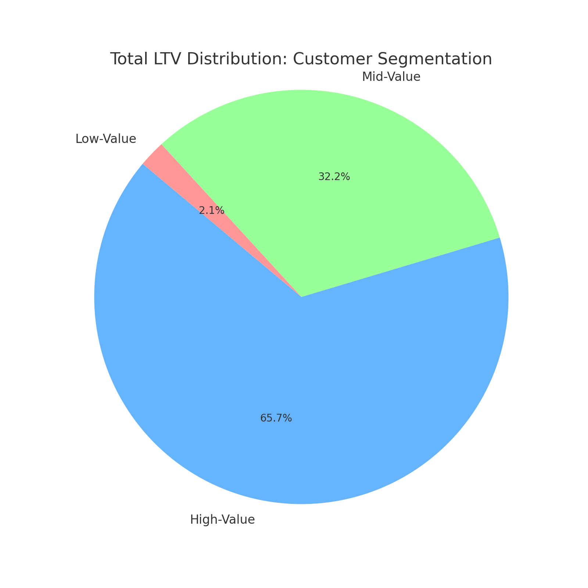

# Sales Data Analysis

## Overview
Analysis of customer behaviour, lifetime value, and retention for an e-commerce company to improve customer retention and maximize revenue.
In order to commence, a view was created.
[📽️*Query*: [Cohort_View](Scripts\cohort_view.sql)]

## Business Questions
1. **Customer Segmentation:** Who are our most valuable customers?
2. **Cohort Analysis:** How do different customer groups generate revenue?
3. **Retention Analysis:** Which customers haven't purchased recently?

## Analysis Approach

### 1. Customer Segmentation Analysis
- Categorized customers based on Total Lifetime Value (LTV).
- Assigned customers to High, Mid, and Low-value segments.
- Calculated key metrics: Total Revenue.

📽️*Query*: [1_Customer_Segmentation](1_customer_segmentation.sql)

📊**Visualization:**

💡**Key Findings:**
- High-value segment (25% of customers) accounts for 65.7% of revenue ($135.6M).
- Mid-value segment (50% of customers) accounts for 32.2% of revenue ($66.3M).
- Low-value segment (25% of customers) accounts for 2.1% of revenue ($4.2M).

📚**Business Insights and Strategic Recommendations:**
- High-value (66% revenue):
    * Offer premium membership program to 12,372 high-value customers.
    * Provide early access to new products.
    * Focus on retention as losing one customer significantly impacts revenue.
- Mid-value (32% revenue):
    * Create upgrade pathway for 24,743 customers through personalized promotions.
    * Target with "next best product" recommendations based on high-value patterns.
    * Potential $66.3M -> $135.6M revenue opportunity if upgraded to high-value status.
- Low-value (2% revenue):
    * Design re-engagement campaigns for 12,372 customers to increase purchase frequency.
    * Test price-sensitive promotions to encourage more frequent purchases.
    * Focus on covering $4.2M segment to mid-value through targeted offers.

### 2. Cohort Analysis
Cohort: Grouping customers according to their first year of purchase.
- Tracked revenue and customer count per cohorts.
- Cohorts were grouped by year of first purchase.
- Analyzed customer retention at a cohort level.

First, we analyze average customer revenue by their cohort year over time.

Visualizing the analysis, 2015-2017 showed consistent spending from customers, but from 2018, customer spending decreased. 2020 being the worst could be attributed to COVID. This finding is concerning, that customer revenue per cohort year is droping year after year.

However, after deeper analysis on what contributes to the total revenue based on the days since the first purchase, the total revenue (customer spending) on the first purchase is over $127M. After that, subsequent customer spending dropped significantly to about $50,000 or less in total. This can be visualized in percentages as shown below:

Insights from the chart above suggests that, on average, a customer spends about 60% of their total_money_spent on the first purchase.

With this latest insight, we will go back and adjust our earlier query (Customer Revenue by Cohort Year) to take account for this. That is, for each Cohort Year, we will only consider the first purchase of each customer, and ignore subsequent purchases since we have found out on average customers spend significanly more on the first purchase.

📽️*Query*: [2_Cohort_Analysis](2_cohort_analysis.sql)

📊**Visualization:**

💡**Key Findings:**
- The visual from our adjusted query is even more pronouced than the earlier one, as expressed by the exponential trend line.
- Revenue per customer shows a startling decreasing trend over time.
    - 2022-2024 cohorts are consistently performing worse than earlier cohorts.
    - NOTE: Although net revenue is increasing, this is likely due to a larger customer base, which is not reflective of customer value.

📚**Business Insights and Strategic Recommendations:**
- Value extracted from customers is decreasing over time and need further investigation.
- In 2023, we saw a drop in number of customers acquired, which is concerning.
- With both lowering Lifetime Value (LTV) and decreasing customer acquisition, the business is facing a potential revenue decline.
- Target 2022-2024 cohorts with personalized re-engagement offers.
- Implementation of loyalty/subscription packages to stabilize revenue flunctuations.
- Apply successful strategies from high-spending 2016-2018 cohorts to newer customers.

### 3. Customer Retention
- Identified customers at risk of churning.
- Analyzed last purchase patterns.
- Calculated customer-specific metrics.

📽️*Query*: [3_Retention_Analysis](3_retention_analysis.sql)

📊**Visualization:**

💡**Key Findings:**
- Cohort churn stabilizes at 90% after 2-3 years, indicating a predictable long-term retention pattern.
- Retention rates are consistently low (8-10%) accross all cohorts, suggesting retention issues are systemic rather than specific to certain years.
- Newer cohorts (2022-2023) show similar churn trajectories, signaling that without intervention, future cohorts will follow the same pattern.

📚**Business Insights and Strategic Recommendations:**
- Strengthen early engagement strategies to target the first 1-2 years with onboarding incentives, loyalty rewards, and personalized offers to improve long-term retention.
- Re-engage high-value churned customers by focusing on targeted win-back campaigns rather than broad retention efforts, as reactivating valuable users may yield higher return-on-investment (ROI).
- Predict and preempt churn risk and use customer-specific warning indicators to proactively intervene with at-risk users before they lapse.

## Technical Details
- **Database:** PostgreSQL.
- **Analysis Tools:** PostgreSQL, DBeaver and VS Code.
- **Visualization:** ChatGPT.